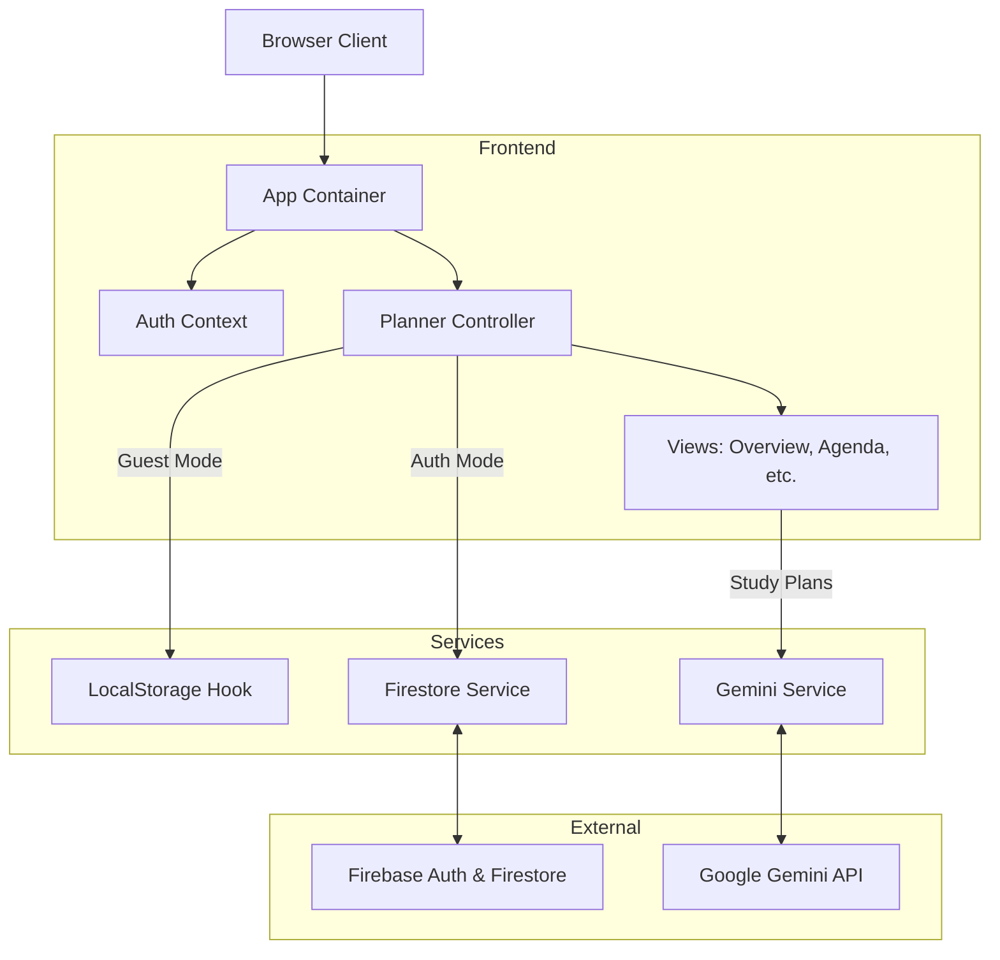

# Architecture Overview

School Planner Pro is a client-side Single Page Application (SPA) built with React and TypeScript. It implements a **Dual Data Source Strategy** to support both offline (Guest) and online (Authenticated) usage seamlessly.

## High-Level Diagram

## Core Concepts

### 1. Dual Data Strategy
The application logic abstracts data sources in `Planner.tsx`. This allows the UI components to remain "dumb" regarding where the data comes from.
- **Guest Mode**: Uses `useLocalStorage` hook. Data is serialized to `window.localStorage` with a `guest-` prefix.
- **Auth Mode**: Uses `useFirestoreCollection` hook and `firestoreService`. Data is synced to Firebase Cloud Firestore under `users/{uid}/`.

### 2. Authentication
- Managed via `AuthContext` (`contexts/AuthContext.tsx`).
- Supports Email/Password and Google Sign-In.
- Guest login creates a dummy user object `{ isGuest: true, ... }`, bypassing Firebase Auth.

### 3. Component Hierarchy
- **App**: Root component, handles Auth loading state.
- **Planner**: Main layout controller. It determines which data source (Local vs Firestore) to pass to child views.
- **Sidebar/BottomNavBar**: Navigation components responsive to screen size.
- **Views**:
  - `Overview`: Dashboard with Recharts visualization.
  - `Agenda/Timetable/Calendar`: Event management views.
  - `GradeTracker`: Weighted grade calculation logic.
  - `Focus`: Pomodoro timer with PIP (Picture-in-Picture) support using React Portals to a new `window.open`.

### 4. AI Integration
- **Service**: `services/geminiService.ts`
- **Model**: `gemini-2.5-flash`
- **Usage**: Generates checklists/study plans for tasks based on titles and subjects.

## Data Model

The application uses a relational-like structure.

### Task
- `id`: string
- `title`: string
- `subject`: string (Linked by name, currently)
- `category`: 'Homework' | 'Exam' | 'Study' | 'Project'
- `dueDate`: Date
- `completed`: boolean
- `recurrence`: 'None' | 'Daily' | 'Weekly' | 'Monthly'

### ClassEvent
- `id`: string
- `subject`: string
- `day`: number (0-6, where 0 is Sunday)
- `startTime`: string (HH:mm)
- `endTime`: string (HH:mm)

### Subject
- `id`: string
- `name`: string
- `goal`: number (Target percentage)
- `color`: string (Key from `COLOR_PALETTE`)

### Grade
- `id`: string
- `subjectId`: string (Foreign Key to Subject)
- `score`: number
- `total`: number
- `weight`: number
